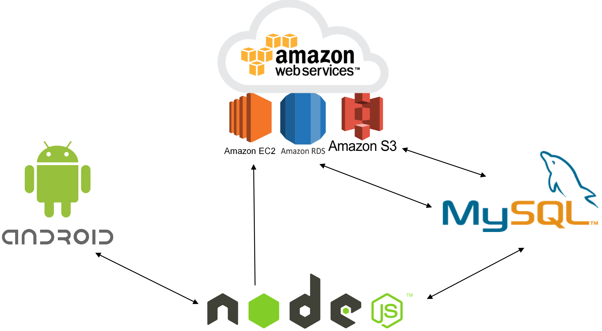

# collecking-seoul

## 소개

`서울 주요명소를 돌아다니며 랜드마크를 모으는 위치기반 모바일 애플리케이션`입니다.

## 개발환경

`BACKEND: Node.js, AWS EC2, AWS RDS, AWS S3, MySQL`

`FRONTEND: Android Studio, Java`

## 팀 인원
- 디자인 : 1명 ([정승후](https://tmdgn07.wixsite.com/huya-portfolio))
- 개발 : 2명 ([권현아](https://github.com/kwonhyeona), [이지은](https://github.com/Leejieun3001))

## 주요 기능
`BACKEND` 
- async.waterfall() 을 사용해 콜백 지옥 해결
- jsonwebtoken(jwt) 을 사용해 토큰기반으로 프론트엔드와 통신
- AWS의 서비스인 EC2를 이용해 구축된 서버를 배포하고, RDS를 통해 MySQL과 연결, S3에 사진을 업로드
- error.json 파일에 작성된 정보를 바탕으로 클라이언트에게 response 반환

`FRONTEND` ([주요코드 보러가기](https://github.com/kwonhyeona/collecking-seoul/blob/master/FRONTEND/README.md))
- [공공데이터포털](https://www.data.go.kr/) 에서 제공하는 [서울특별시 관광 정보](https://www.data.go.kr/dataset/3054257/fileData.do) api를 통해 데이터 적용
- Retrofit2, OkHttp3 라이브러리를 사용해 서버에게 요청
- MVC패턴을 사용해 모델과 뷰를 분리
- 커스텀뷰인 RecyclerView를 사용해 효율적으로 데이터를 리스트로 제공
- SNS서비스인 카카오톡과 페이스북 로그인 연동
- GPS를 이용해 위치 기반으로 가까운 랜드마크 정보를 제공 (추가 예정)
- 간단한 게임을 통해 랜드마크를 수집할 수 있는 게이미피케이션(Gamefication) 적용 (추가 예정)

## 기대효과
- 서울의 관광명소를 홍보해 관광산업의 활성화를 돕는다.
- 외국인에게 서울의 관광명소를 소개해 서울을 좀 더 즐길 수 있도록 한다.
